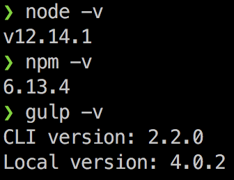

# Getting started

---

## Table of Contents

* [Requirements](#markdown-header-requirements)
* [Instructions](#markdown-header-instructions)
* [Helpful gulp commands](#markdown-header-helpful-gulp-commands)

---

# Requirements

- Terminal (macOS) or Command Prompt (PC)
- [Node](https://nodejs.org/en/)
- [npm](https://www.npmjs.com/get-npm)
- [Gulp](https://gulpjs.com/docs/en/getting-started/quick-start)

---

# Instructions

1. If you haven't already cloned the repository, do so by running the following in your command line:

  ```
  git clone https://bitbucket.org/uclaucomm/ucla-bruin-components.git
  ```

2. Navigate to your local copy:

  ```
  cd ucla-bruin-components
  ```

3. Make sure `node`, `npm`, and `gulp` have been installed successfully.

  `node -v`

  `npm -v`

  `gulp -v`

  - If installed successfully, these commands should return a version number, similar to below:

    

4. Install package dependencies:

    ```
    npm install
    ```

5. Compile assets and watch any changes:

    ```
    gulp build && gulp watch
    ```

Your local environment should be running at [http://localhost:3000](http://localhost:3000).

---
# Helpful gulp commands

| Task | Description |
|-|-|
| `build` | Build Fractal framework, build expanded styling and scripts for both documentation and components library, and remove string filters (used for production versioning) |
| `watch` | Start Fractal development web server, watch for styling and script changes for both the documentation and components library, and run linters for both the documentation and components library |
| *`production` | Build Fractal framework and build compressed styling and scripts for both documentation and components library |
| *`addImageFilterStrs` | Add filter string for images |

 *used in production builds and should only be used locally to test behaviors expected in production

 ---

:arrow_left: [Go Back to Main README](https://bitbucket.org/uclaucomm/ucla-bruin-components/src/campus/)
